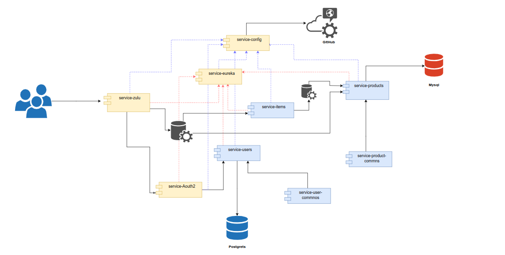

# Iniciar Proyecto

 

Primero debe revisar la configuración de la bases de datos. Para este proyecto se usan dos bases de datos: 1 para productos  y otra para usuarios. La configuración está en el archivos **application.properties** de los proyectos: **servicio-usuarios** y **servicio-productos**.  El ordend es el siguiente

     - 1. servicio-config
     - 2. servicio-eureka-server
     - 3  servicio-producto (iniciar dos instancias)
     - 4. servicio-itemes
     - 5. servicio-usuarios
     - 6. servicio-oauth
     - 7. servicio-zuul

Por otra parte, debe crear un repositorio en git para que suba los archivos de configuración, en su defecto cambiar la configuración y apunte al directorio **config**
